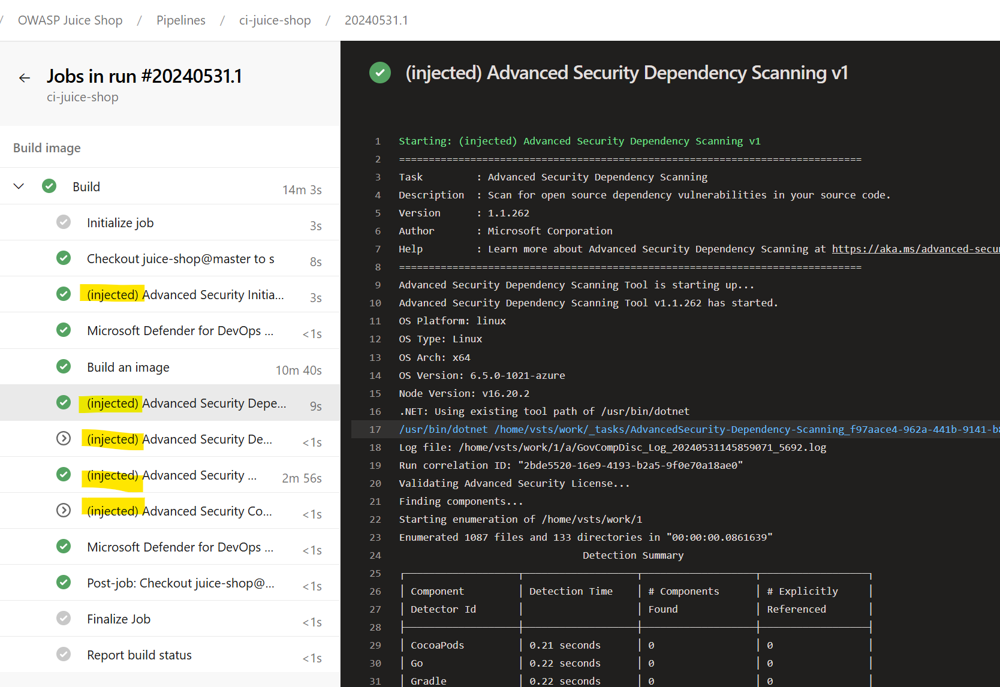
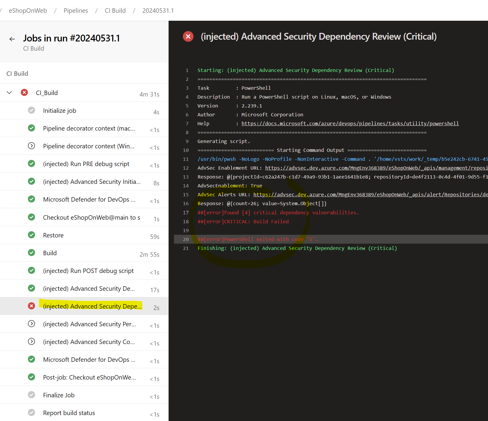
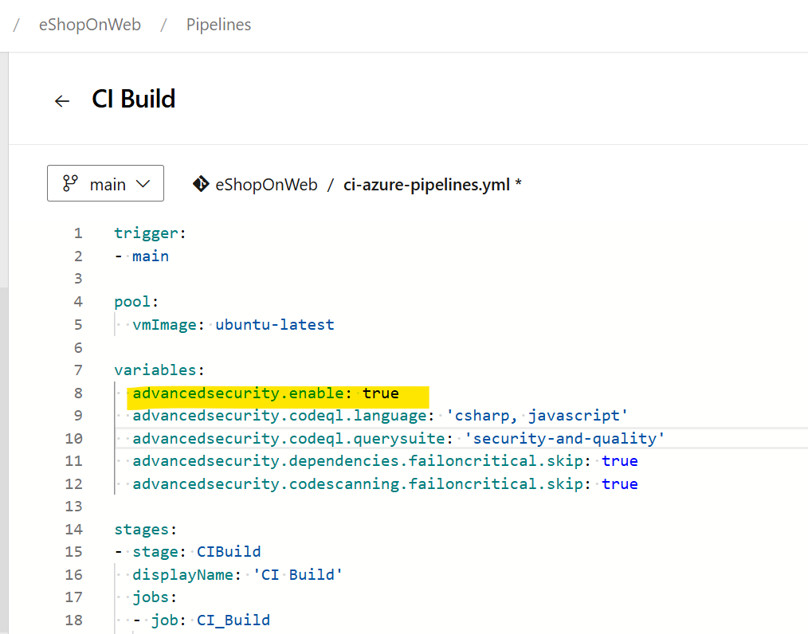
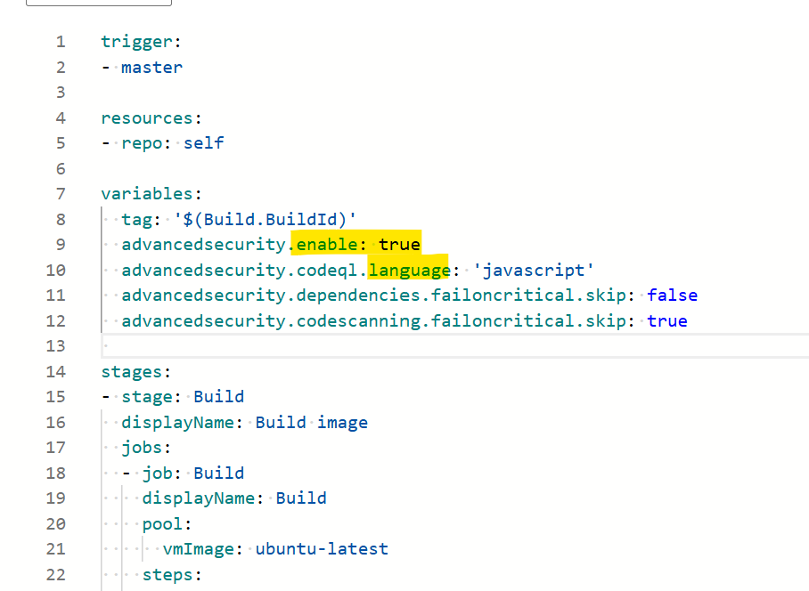

# GitHub Advanced Security for Azure DevOps Decorator Tools

> Decorator extension for Azure DevOps. The purpose of this extension is to automatically inject GitHub Advanced Security tasks into your Continuous Integration (CI) pipelines. The extension helps to improve the security of your applications and makes your development process more efficient.

## Overview

GitHub Advanced Security helps to identify potential security vulnerabilities within your code. By integrating these security checks into your CI pipelines, you can ensure that every code change is automatically scanned for issues before it is merged.

This decorator tool for Azure DevOps makes it easy to add these security checks to your pipelines. Once installed, the decorator will automatically inject the necessary tasks to your CI pipeline, saving you the time and effort of manual configuration.

## Features

- Automatic injection of GitHub Advanced Security tasks into your CI pipelines.
- Easy installation and setup.
- Helps to identify and fix security vulnerabilities early in the development process.

## Getting Started

To get started with the GitHub Advanced Security for Azure DevOps Decorator Tools, install the Azure DevOps extension and configure the variables to control how the GitHub Advanced Security tasks will work. 

## Variables

Use these variables in the main CI pipeline to control the behavior and values of the decorator
variables:
- __system.debugContext: true__
  - When set to true, the pipeline will run in debug mode. This will display additional information in the logs.
- __advancedsecurity.enable: true__
  - When set to true, the pipeline will inject the Advanced Security analysis. 
  - To enable the Advanced Security analysis, set the advancedsecurity.enable variable to true.
- __advancedsecurity.skip: true__
  - When set to true, the pipeline will skip the Advanced Security analysis. 
  - To skip the Advanced Security analysis, set the advancedsecurity.skip variable to true.
- __advancedsecurity.codeql.language: 'csharp, javascript'__ 
  - Allowed values: csharp, cpp, go, java, javascript, python, ruby, swift.
  - To specify the languages to analyze, set the advancedsecurity.codeql.language variable.
- __advancedsecurity.codeql.querysuite: 'security-and-quality'__
  - Allowed values: code-scanning, security-extended, security-experimental, security-and-quality
  - To specify the query suite to use, set the advancedsecurity.codeql.querysuite variable.
- __advancedsecurity.dependencies.failoncritical.skip: true__
   - When set to true, the pipeline will skip the Advanced Security Dependency Review (Fail on Critical).
- __advancedsecurity.codescanning.failoncritical.skip: true__
   - When set to true, the pipeline will skip the Advanced Security Code Scanning (Fail on Critical).
- __advancedsecurity.codeql.autobuild.enable: true__
   - When set to true, the pipeline will inject the Advanced Security AutoBuild.

## Images

Injected GitHub Advanced Security tasks:

Fail on critical vulnerabilities found:

GitHub Advanced Security variables:

